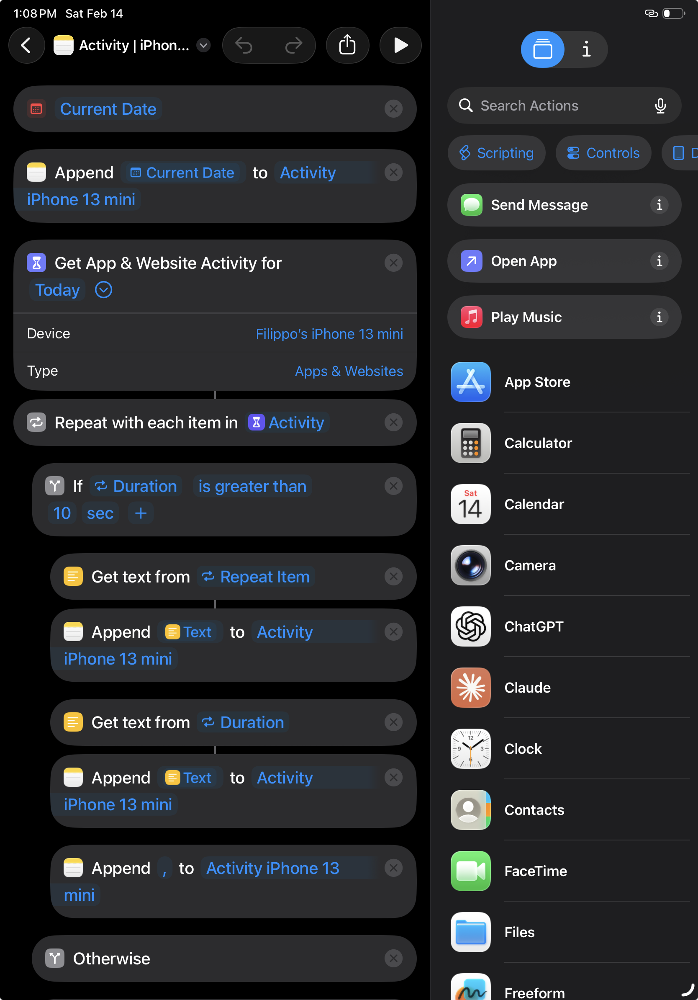
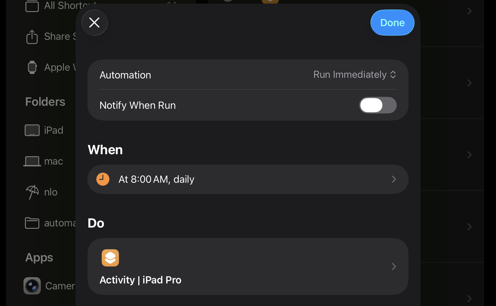

# Screen Time Analyzer

A Python tool to analyze Apple device (iPhone, iPad, Mac) usage time, bypassing the limitations of "Screen Time" data export.

## How It Works
Since Apple does not provide a direct API or export for Screen Time data, this project relies on **Shortcuts** that run periodically on your devices.
These shortcuts save a text file containing a list of apps and their cumulative daily usage time.
The files are manually exported in Markdown format.

The software:
1. Reads the log files generated by the shortcuts.
2. Parses the data (handling multiple formats and timestamps).
3. Saves raw data into a local SQLite database (`data/db/screentime.db`).
4. Calculates **usage intervals** by computing the difference between consecutive snapshots.
   - *Smart Processing*: Automatically detects the start of daily logs and prevents "ghost usage" assignments.
5. Archives the processed files.
6. Visualizes the data via an interactive **Streamlit Dashboard**.

## Project Structure

```
ScreenTimeAnalyzer/
├── data/                    # Data folder (Ignored by Git for privacy)
│   ├── [DeviceFile].txt     # Input files (e.g., "Activity iPhone.txt")
│   ├── [DeviceFile].md      # Input files (e.g., "Activity iPhone.md")
│   ├── [DeviceName]/        # Input folders (e.g., "iPhone", "iPad")
│   ├── processed/           # Archive of processed files
│   └── db/                  # Contains the SQLite database (screentime.db)
├── src/
│   ├── app.py               # Streamlit Dashboard Entry Point
│   ├── main.py              # Main ingestion script
│   ├── log_parser.py        # File parsing logic
│   ├── processing.py        # Usage interval calculation
│   ├── database.py          # DB schema and connection management
│   └── visualization/       # Visualization modules
└── README.md
```

## Installation

1.  **Clone the repository:**
    ```bash
    git clone https://github.com/your-username/ScreenTimeAnalyzer.git
    cd ScreenTimeAnalyzer
    ```

2.  **Install dependencies:**
    ```bash
    pip install -r requirements.txt
    ```

## Usage

### 1. Shortcut Setup
To simplify the setup, you can directly download the shortcut used to export the data:
[Download iCloud Shortcut](https://www.icloud.com/shortcuts/a33e31659b2f4bd88005b953993ae0f4)

**Configuration Parameters:**
1.  **Note**: Specify the name of the Note where the data will be appended (e.g., "Activity iPhone 13 mini"). *Note: You will need to export this note to a markdown file for the tool to process.*
2.  **Filter (Optional)**: In the `If` block, you can set a threshold to ignore apps/websites with usage duration less than a certain value (e.g., 10 seconds).
3.  **Get App & Website Activity action**:
    -   **Device**: Select the specific device you want to track.
    -   **Type**: Set this to **"Apps & Websites"**.



### 2. Configure Automation
To ensure continuous data collection, set up an **Automation** in the Shortcuts app:
1.  Go to the **Automation** tab and create a new **Automation**.
2.  **Trigger**: Choose **Time of Day** (e.g., 08:00 AM). *Recommendation: Run it multiple times a day or at least once before midnight. The more often you run it, the higher the temporal resolution of the data.*
3.  **Action**: Add the **Run Shortcut** action and select the `Activity | iPhone` shortcut you just downloaded.
4.  **Important**: Turn **OFF** "Ask Before Running" and "Notify When Run" to ensure it runs silently in the background.
5.  **Important**: Setup automation on each device you want to track. I tried to run multiple shortcuts on the same device but there might be synchronization issues.



### 3. Loading Data
You can load data in two ways:
1.  **Direct File Drop**: Simply copy the `.txt` or `.md` files into the `data/` folder.
    -   The filename determines the device name (e.g., `Activity iPhone 13 mini.txt` -> Device: "iPhone 13 mini").
2.  **Subfolders**: Create a subfolder in `data/` (e.g., `data/Activity iPhone/`) and place files there.

Once processed, files are automatically moved to `data/processed/` to keep your workspace clean.

### 4. Running the Dashboard
The easiest way to use the tool is via the Dashboard:

```bash
streamlit run src/app.py
```

## Dashboard Features

-   **KPI Overview**: Total hours, Daily Average, and Top App.
-   **Hourly Activity Patterns**: Bar chart showing average usage distribution throughout the day (0-24h).
-   **Weekly Screen Time Activity**: Stacked bar chart showing daily average usage per week.
-   **Daily Activity Calendar**: A heatmap-style calendar view to visualize usage intensity over the year.
-   **Data Update**: Integrated "Update Data" button to ingest new files directly from the UI.
